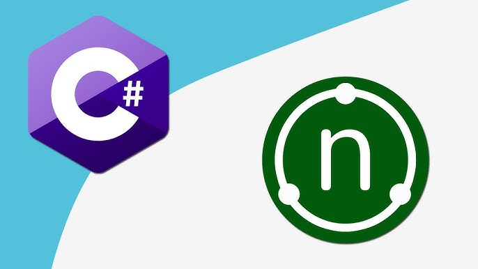

# Iniciación al testing en ASP.NET Core

## Testing
El testing es una parte fundamental en el desarrollo de software. Nos permite asegurar que nuestro código funciona correctamente y que no se rompe cuando hacemos cambios en él. Para ello, es importante que diseñemos nuestros tests de forma que sean fáciles de mantener, que nos permitan detectar errores de forma rápida y que cubran todos los aspectos de nuestro código.

Tenemos varios niveles de tests:
- **Tests unitarios**: Estos tests se encargan de probar una unidad de código (una clase, un método, etc.) de forma aislada. Para ello, se suelen utilizar mocks para aislar la unidad de código que estamos probando de las dependencias que tiene.
- **Tests de integración**: Estos tests se encargan de probar que las distintas unidades de código funcionan correctamente cuando se integran entre ellas. Para ello, se suelen utilizar bases de datos en memoria para simular el acceso a datos.
- **Tests End-to-End**: Estos tests se encargan de probar que todo el sistema funciona correctamente. Para ello, se suelen utilizar herramientas que simulan un navegador web y que permiten simular las acciones que haría un usuario en la aplicación. Por ejemplo, cuando usamos Postman.

## Configuración del proyecto
Para realizar tests unitarios con ASP.NET Core podemos utilizar [NUnit](https://nunit.org/) y [Moq](https://github.com/moq/moq4). Para ello, debemos añadir las dependencias correspondientes en nuestro archivo de proyecto (`.csproj`):

```xml
<ItemGroup>
    <PackageReference Include="Microsoft.NET.Test.Sdk" Version="17.0.0" />
    <PackageReference Include="NUnit" Version="3.13.3" />
    <PackageReference Include="NUnitAdapter" Version="4.0.0" />
    <PackageReference Include="Moq" Version="4.18.2" />
</ItemGroup>
```

## Tests unitarios
Para realizar tests unitarios en clases que no dependan de otras, no necesitamos realizar mocks. Podemos usar NUnit para realizar los tests. Por ejemplo, de un repositorio o mapeador o servicio sin dependencias.

Es importante que los tests sean independientes, es decir, que no dependan unos de otros. Para ello, debemos asegurarnos de que cada test se encarga de inicializar los datos que necesita para funcionar. Podemos utilizar los atributos `[SetUp]` y `[TearDown]` que se ejecutan antes y después de cada test, respectivamente. También podemos utilizar `[OneTimeSetUp]` y `[OneTimeTearDown]` que se ejecutan antes y después de todos los tests de la clase, respectivamente.

Además, usaremos las aserciones de NUnit para comprobar que el resultado de la ejecución de nuestro código es el esperado. Por ejemplo:

```csharp
using NUnit.Framework;
using System.Collections.Generic;
using System.Linq;

[TestFixture]
public class RaquetasRepositoryImplTest
{
    private RaquetasRepository repository;

    [SetUp]
    public void SetUp()
    {
        // Inicializamos el repositorio
        repository = new RaquetasRepositoryImpl();
    }

    [Test]
    public void FindAll()
    {
        var raquetas = repository.FindAll();

        Assert.Multiple(() =>
        {
            Assert.IsNotNull(raquetas);
            Assert.AreEqual(3, raquetas.Count());
        });
    }

    [Test]
    public void FindById()
    {
        var raqueta = repository.FindById(1L);

        Assert.Multiple(() =>
        {
            Assert.IsNotNull(raqueta);
            Assert.AreEqual("Babolat", raqueta.Marca);
            Assert.AreEqual("Pure Aero", raqueta.Modelo);
            Assert.AreEqual(199.95, raqueta.Precio);
        });
    }

    [Test]
    public void FindByIdNotFound()
    {
        var raqueta = repository.FindById(100L);

        Assert.Multiple(() =>
        {
            Assert.IsNotNull(raqueta);
            Assert.IsFalse(raqueta.IsPresent());
        });
    }
}
```

Si estamos testeando controladores o servicios, es posible que necesitemos realizar mocks de las dependencias que tienen. Para ello, podemos utilizar Moq.

Para simular el comportamiento de los mocks, podemos utilizar el método `Setup` de Moq. Para verificar que se ha llamado a un método de un mock, podemos utilizar el método `Verify` de Moq.

```csharp
using Moq;
using NUnit.Framework;
using System;
using System.Collections.Generic;
using System.Linq;

[TestFixture]
public class RaquetasServiceImplTest
{
    private Mock<IRaquetaValidator> raquetaValidatorMock;
    private Mock<IRaquetasRepository> raquetasRepositoryMock;
    private RaquetasServiceImpl raquetasService;

    [SetUp]
    public void SetUp()
    {
        raquetaValidatorMock = new Mock<IRaquetaValidator>();
        raquetasRepositoryMock = new Mock<IRaquetasRepository>();
        raquetasService = new RaquetasServiceImpl(raquetaValidatorMock.Object, raquetasRepositoryMock.Object);
    }

    [Test]
    public void FindAll()
    {
        // Lo que vamos a simular
        raquetasRepositoryMock.Setup(repo => repo.FindAll())
            .Returns(new List<Raqueta> { /* datos de prueba */ });

        // Test
        var list = raquetasService.FindAll();

        // Comprobaciones
        Assert.Multiple(() =>
        {
            Assert.IsNotNull(list);
            Assert.AreEqual(3, list.Count());
        });

        // Verificamos que se ha llamado al método
        raquetasRepositoryMock.Verify(repo => repo.FindAll(), Times.Once);
    }

    [Test]
    public void FindById()
    {
        // Lo que vamos a simular
        raquetasRepositoryMock.Setup(repo => repo.FindById(1L))
            .Returns(new Raqueta { Marca = "Babolat", Modelo = "Pure Aero", Precio = 199.95 });

        // Test
        var raqueta = raquetasService.FindById(1L);

        // Comprobaciones
        Assert.Multiple(() =>
        {
            Assert.IsNotNull(raqueta);
            Assert.AreEqual("Babolat", raqueta.Marca);
            Assert.AreEqual("Pure Aero", raqueta.Modelo);
            Assert.AreEqual(199.95, raqueta.Precio);
        });

        // Verificamos que se ha llamado al método
        raquetasRepositoryMock.Verify(repo => repo.FindById(1L), Times.Once);
    }

    [Test]
    public void FindByIdNotFound()
    {
        raquetasRepositoryMock.Setup(repo => repo.FindById(-100L))
            .Returns((Raqueta)null);

        // Salta la excepción
        var ex = Assert.Throws<Exception>(() => raquetasService.FindById(-100L));
        Assert.IsTrue(ex.Message.Contains("No se ha encontrado la raqueta con id: -100"));

        // Verificamos que se ha llamado al método
        raquetasRepositoryMock.Verify(repo => repo.FindById(-100L), Times.Once);
    }
}
```

## Tests de integración
Para hacer los tests de integración podemos usar solo NUnit con las clases y sus respectivas dependencias reales. Sin embargo, si queremos hacer los tests de integración usando el contexto ASP.NET Core, debemos usar la anotación `[TestFixture]` en la clase de test y configurar un `WebApplicationFactory` para inicializar el contexto de la aplicación y de inyectar las dependencias que necesitemos.

```csharp
using Microsoft.AspNetCore.Mvc.Testing;
using NUnit.Framework;
using System.Net.Http;
using System.Threading.Tasks;

[TestFixture]
public class RaquetasControllerIntegrationTest
{
    private HttpClient _client;

    [OneTimeSetUp]
    public void SetUp()
    {
        var factory = new WebApplicationFactory<Startup>();
        _client = factory.CreateClient();
    }

    [Test]
    public async Task GetRaquetas_ReturnsSuccessStatusCode()
    {
        var response = await _client.GetAsync("/api/raquetas");
        response.EnsureSuccessStatusCode();

        var content = await response.Content.ReadAsStringAsync();
        Assert.IsNotNull(content);
    }
}
```

# Práctica de clase: Testing
1. Realiza los test unitarios de tus servicios, mapeadores y controladores de funkos y categorías, mockeando las dependencias necesarias.
2. Crea el test del edpoint de categorías usando supertest mockeando los elementos necesarios.

