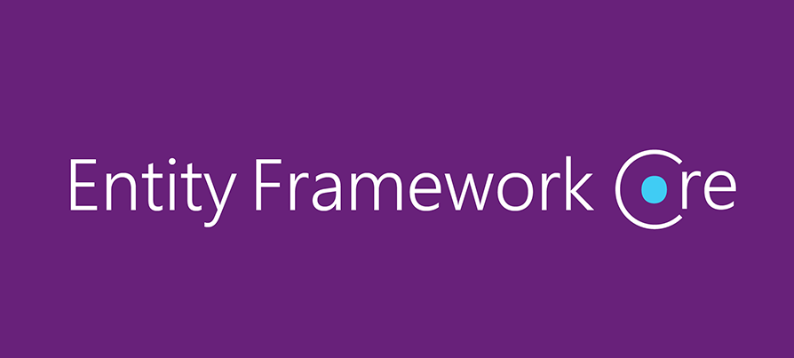

- [Entity Framework Core](#entity-framework-core)
    - [Configuración en `appsettings.json`](#configuración-en-appsettingsjson)
  - [Definiendo la conexión a la base de datos](#definiendo-la-conexión-a-la-base-de-datos)
    - [Configuración en `Startup.cs` o `Program.cs`](#configuración-en-startupcs-o-programcs)
      - [En `Startup.cs`:](#en-startupcs)
      - [En `Program.cs` (para .NET 6 y posteriores):](#en-programcs-para-net-6-y-posteriores)
    - [Configuración de la clase `ApplicationDbContext`](#configuración-de-la-clase-applicationdbcontext)
    - [Notas adicionales](#notas-adicionales)
  - [Definiendo tablas personalizadas o insertando datos](#definiendo-tablas-personalizadas-o-insertando-datos)
  - [Entidades, Modelos y Esquemas](#entidades-modelos-y-esquemas)
    - [Identificadores](#identificadores)
      - [Autoincremental vs UUID](#autoincremental-vs-uuid)
    - [Marcas temporales](#marcas-temporales)
  - [Relaciones entre entidades](#relaciones-entre-entidades)
    - [Relación Uno a Uno (OneToOne)](#relación-uno-a-uno-onetoone)
    - [Relación Uno a Muchos (OneToMany/ManyToOne)](#relación-uno-a-muchos-onetomanymanytoone)
    - [Relación Muchos a Muchos (ManyToMany)](#relación-muchos-a-muchos-manytomany)
    - [Relaciones Embebidas (Embedded)](#relaciones-embebidas-embedded)
    - [Relaciones jerárquicas](#relaciones-jerárquicas)
    - [Opciones de cascada](#opciones-de-cascada)
    - [La opción OrphanRemoval](#la-opción-orphanremoval)
    - [Borrado Físico vs Borrado Lógico](#borrado-físico-vs-borrado-lógico)
    - [El problema de la recursión infinita y la bidireccional](#el-problema-de-la-recursión-infinita-y-la-bidireccional)
    - [Usando anotaciones de datos](#usando-anotaciones-de-datos)
      - [Ejemplo de Clase con Anotaciones](#ejemplo-de-clase-con-anotaciones)
    - [Explicación de las Anotaciones Utilizadas](#explicación-de-las-anotaciones-utilizadas)
    - [Otras Anotaciones Útiles](#otras-anotaciones-útiles)
    - [Relaciones entre Entidades](#relaciones-entre-entidades-1)
  - [Repositorios en Entity Framework Core](#repositorios-en-entity-framework-core)
    - [Creando consultas para nuestros repositorios](#creando-consultas-para-nuestros-repositorios)
    - [Consultas generadas automáticamente](#consultas-generadas-automáticamente)
    - [Consultas con LINQ y SQL](#consultas-con-linq-y-sql)
    - [Operadores de Consulta Básicos en LINQ](#operadores-de-consulta-básicos-en-linq)
      - [1. `Where`](#1-where)
      - [2. `Select`](#2-select)
      - [3. `OrderBy` y `OrderByDescending`](#3-orderby-y-orderbydescending)
      - [4. `GroupBy`](#4-groupby)
      - [5. `Join`](#5-join)
    - [Operadores de Agregación en LINQ](#operadores-de-agregación-en-linq)
      - [1. `Count`](#1-count)
      - [2. `Sum`](#2-sum)
      - [3. `Average`](#3-average)
      - [4. `Min` y `Max`](#4-min-y-max)
    - [Consultas Complejas en LINQ](#consultas-complejas-en-linq)
      - [1. `Any` y `All`](#1-any-y-all)
      - [2. `First` y `FirstOrDefault`](#2-first-y-firstordefault)
      - [3. `Single` y `SingleOrDefault`](#3-single-y-singleordefault)
      - [4. `SelectMany`](#4-selectmany)
    - [Ejemplo Completo](#ejemplo-completo)
  - [Testeando el Repositorio EF Core](#testeando-el-repositorio-ef-core)
- [Práctica de clase: Entity Framework Core y SQL](#práctica-de-clase-entity-framework-core-y-sql)


# Entity Framework Core


[ASP.NET Core](https://docs.microsoft.com/en-us/aspnet/core) es un framework de desarrollo web de código abierto y multiplataforma desarrollado por Microsoft. ASP.NET Core permite construir aplicaciones web modernas, basadas en la nube y conectadas a Internet.

[Entity Framework Core](https://docs.microsoft.com/en-us/ef/core/) (EF Core) es un ORM (Object-Relational Mapper) ligero, extensible y multiplataforma para .NET. EF Core permite a los desarrolladores trabajar con una base de datos utilizando objetos .NET, eliminando la necesidad de la mayoría del código de acceso a datos que los desarrolladores normalmente necesitan escribir.


### Configuración en `appsettings.json`

## Definiendo la conexión a la base de datos

En ASP.NET Core, la configuración de la conexión a la base de datos se realiza en el archivo `appsettings.json` y se configura en el `Startup.cs` o en el `Program.cs` (en .NET 6 y posteriores).

Primero, cambia la configuración de la conexión a la base de datos en `appsettings.json` para usar PostgreSQL:

```json
{
  "ConnectionStrings": {
    "DefaultConnection": "Host=localhost;Database=MyDatabase;Username=myusername;Password=mypassword"
  },
  "Logging": {
    "LogLevel": {
      "Default": "Information",
      "Microsoft": "Warning",
      "Microsoft.Hosting.Lifetime": "Information"
    }
  },
  "AllowedHosts": "*"
}
```

### Configuración en `Startup.cs` o `Program.cs`

#### En `Startup.cs`:

Si estás usando una versión de .NET anterior a .NET 6, tu configuración en `Startup.cs` se verá así:

```csharp
using Microsoft.AspNetCore.Builder;
using Microsoft.AspNetCore.Hosting;
using Microsoft.Extensions.Configuration;
using Microsoft.Extensions.DependencyInjection;
using Microsoft.Extensions.Hosting;
using Microsoft.EntityFrameworkCore;
using YourNamespace.Data;

public class Startup
{
    public IConfiguration Configuration { get; }

    public Startup(IConfiguration configuration)
    {
        Configuration = configuration;
    }

    public void ConfigureServices(IServiceCollection services)
    {
        services.AddDbContext<ApplicationDbContext>(options =>
            options.UseNpgsql(
                Configuration.GetConnectionString("DefaultConnection")));
        services.AddControllers();
    }

    public void Configure(IApplicationBuilder app, IWebHostEnvironment env)
    {
        if (env.IsDevelopment())
        {
            app.UseDeveloperExceptionPage();
        }
        else
        {
            app.UseExceptionHandler("/Home/Error");
            app.UseHsts();
        }
        app.UseHttpsRedirection();
        app.UseRouting();
        app.UseAuthorization();

        app.UseEndpoints(endpoints =>
        {
            endpoints.MapControllers();
        });
    }
}
```

#### En `Program.cs` (para .NET 6 y posteriores):

Si estás usando .NET 6 o una versión posterior, la configuración se realiza en `Program.cs`:

```csharp
using Microsoft.EntityFrameworkCore;
using YourNamespace.Data;

var builder = WebApplication.CreateBuilder(args);

// Add services to the container.
builder.Services.AddControllers();
builder.Services.AddDbContext<ApplicationDbContext>(options =>
    options.UseNpgsql(builder.Configuration.GetConnectionString("DefaultConnection")));

var app = builder.Build();


app.UseHttpsRedirection();
app.UseRouting();
app.UseAuthorization();

app.MapControllers();

app.Run();
```

### Configuración de la clase `ApplicationDbContext`

Finalmente, asegúrate de que tu clase `ApplicationDbContext` esté configurada correctamente. Aquí tienes un ejemplo básico:

```csharp
using Microsoft.EntityFrameworkCore;

namespace YourNamespace.Data
{
    public class ApplicationDbContext : DbContext
    {
        public ApplicationDbContext(DbContextOptions<ApplicationDbContext> options)
            : base(options)
        {
        }

        // Define tus DbSets aquí. Por ejemplo:
        public DbSet<YourEntity> YourEntities { get; set; }
    }
}
```

### Notas adicionales

1. **Paquetes NuGet**: Asegúrate de tener los paquetes necesarios instalados. Puedes instalar el paquete de Entity Framework Core para PostgreSQL usando el siguiente comando en la consola del Administrador de paquetes:

    ```sh
    dotnet add package Npgsql.EntityFrameworkCore.PostgreSQL
    ```

2. **Migraciones**: No olvides crear y aplicar las migraciones para tu base de datos:

    ```sh
    dotnet ef migrations add InitialCreate
    dotnet ef database update
    ```

Con estas configuraciones, deberías estar listo para usar PostgreSQL en tu aplicación ASP.NET Core con una API REST.


## Definiendo tablas personalizadas o insertando datos

Para definir tablas personalizadas o insertar datos iniciales en EF Core, puedes usar el método `OnModelCreating` en tu clase `DbContext`.

```csharp
public class ApplicationDbContext : DbContext
{
    public ApplicationDbContext(DbContextOptions<ApplicationDbContext> options)
        : base(options)
    {
    }

    public DbSet<MyEntity> MyEntities { get; set; }

    protected override void OnModelCreating(ModelBuilder modelBuilder)
    {
        base.OnModelCreating(modelBuilder);

        // Definición de tablas personalizadas
        modelBuilder.Entity<MyEntity>(entity =>
        {
            entity.ToTable("MyCustomTable");
            entity.HasKey(e => e.Id);
            entity.Property(e => e.Name).IsRequired().HasMaxLength(50);
        });

        // Insertando datos iniciales
        modelBuilder.Entity<MyEntity>().HasData(
            new MyEntity { Id = 1, Name = "Initial Data" }
        );
    }
}
```

## Entidades, Modelos y Esquemas

### Identificadores

#### Autoincremental vs UUID

En EF Core, puedes usar propiedades autoincrementales o UUIDs como identificadores de tus entidades.

**Autoincremental:**

```csharp
public class MyEntity
{
    public int Id { get; set; }
    public string Name { get; set; }
}
```

**UUID:**

```csharp
public class MyEntity
{
    public Guid Id { get; set; } = Guid.NewGuid();
    public string Name { get; set; }
}
```

### Marcas temporales

Para agregar marcas temporales a tus entidades, puedes usar las propiedades `DateTime`.

```csharp
public class MyEntity
{
    public int Id { get; set; }
    public string Name { get; set; }
    public DateTime CreatedAt { get; set; }
    public DateTime UpdatedAt { get; set; }
}
```

Y configurar las marcas temporales en `OnModelCreating`:

```csharp
protected override void OnModelCreating(ModelBuilder modelBuilder)
{
    base.OnModelCreating(modelBuilder);

    modelBuilder.Entity<MyEntity>(entity =>
    {
        entity.Property(e => e.CreatedAt)
            .HasDefaultValueSql("GETDATE()")
            .ValueGeneratedOnAdd();
        
        entity.Property(e => e.UpdatedAt)
            .HasDefaultValueSql("GETDATE()")
            .ValueGeneratedOnAddOrUpdate();
    });
}
```

## Relaciones entre entidades

### Relación Uno a Uno (OneToOne)

```csharp
public class User
{
    public int Id { get; set; }
    public string Name { get; set; }
    public UserProfile Profile { get; set; }
}

public class UserProfile
{
    public int Id { get; set; }
    public string Bio { get; set; }
    public int UserId { get; set; }
    public User User { get; set; }
}
```

```csharp
protected override void OnModelCreating(ModelBuilder modelBuilder)
{
    modelBuilder.Entity<User>()
        .HasOne(u => u.Profile)
        .WithOne(p => p.User)
        .HasForeignKey<UserProfile>(p => p.UserId);
}
```

### Relación Uno a Muchos (OneToMany/ManyToOne)

```csharp
public class Blog
{
    public int Id { get; set; }
    public string Title { get; set; }
    public ICollection<Post> Posts { get; set; }
}

public class Post
{
    public int Id { get; set; }
    public string Content { get; set; }
    public int BlogId { get; set; }
    public Blog Blog { get; set; }
}
```

```csharp
protected override void OnModelCreating(ModelBuilder modelBuilder)
{
    modelBuilder.Entity<Blog>()
        .HasMany(b => b.Posts)
        .WithOne(p => p.Blog)
        .HasForeignKey(p => p.BlogId);
}
```

### Relación Muchos a Muchos (ManyToMany)

A partir de EF Core 5.0, las relaciones muchos a muchos se configuran automáticamente.

```csharp
public class Student
{
    public int Id { get; set; }
    public string Name { get; set; }
    public ICollection<Course> Courses { get; set; }
}

public class Course
{
    public int Id { get; set; }
    public string Title { get; set; }
    public ICollection<Student> Students { get; set; }
}
```

```csharp
protected override void OnModelCreating(ModelBuilder modelBuilder)
{
    modelBuilder.Entity<Student>()
        .HasMany(s => s.Courses)
        .WithMany(c => c.Students);
}
```

### Relaciones Embebidas (Embedded)

En EF Core, no hay una característica directa para relaciones embebidas como en JPA, pero puedes usar tipos de propiedad.

```csharp
public class Address
{
    public string Street { get; set; }
    public string City { get; set; }
}

public class User
{
    public int Id { get; set; }
    public string Name { get; set; }
    public Address Address { get; set; }
}
```

```csharp
protected override void OnModelCreating(ModelBuilder modelBuilder)
{
    modelBuilder.Entity<User>()
        .OwnsOne(u => u.Address);
}
```

### Relaciones jerárquicas

Para relaciones jerárquicas, puedes usar la misma entidad como propiedad de navegación.

```csharp
public class Category
{
    public int Id { get; set; }
    public string Name { get; set; }
    public int? ParentCategoryId { get; set; }
    public Category ParentCategory { get; set; }
    public ICollection<Category> SubCategories { get; set; }
}
```

```csharp
protected override void OnModelCreating(ModelBuilder modelBuilder)
{
    modelBuilder.Entity<Category>()
        .HasMany(c => c.SubCategories)
        .WithOne(c => c.ParentCategory)
        .HasForeignKey(c => c.ParentCategoryId);
}
```

### Opciones de cascada

Puedes configurar el comportamiento de cascada en `OnModelCreating`.

```csharp
modelBuilder.Entity<Blog>()
    .HasMany(b => b.Posts)
    .WithOne(p => p.Blog)
    .OnDelete(DeleteBehavior.Cascade);
```

### La opción OrphanRemoval

En EF Core, el equivalente a `orphanRemoval` es `DeleteBehavior.Cascade`.

### Borrado Físico vs Borrado Lógico

Para implementar el borrado lógico, puedes agregar una propiedad `IsDeleted` y filtrar en las consultas.

```csharp
public class MyEntity
{
    public int Id { get; set; }
    public string Name { get; set; }
    public bool IsDeleted { get; set; }
}
```

```csharp
public override int SaveChanges()
{
    foreach (var entry in ChangeTracker.Entries<MyEntity>())
    {
        if (entry.State == EntityState.Deleted)
        {
            entry.State = EntityState.Modified;
            entry.Entity.IsDeleted = true;
        }
    }

    return base.SaveChanges();
}
```

### El problema de la recursión infinita y la bidireccional

Para evitar la recursión infinita en JSON, puedes usar atributos como `[JsonIgnore]`.

```csharp
public class Blog
{
    public int Id { get; set; }
    public string Title { get; set; }
    [JsonIgnore]
    public ICollection<Post> Posts { get; set; }
}

public class Post
{
    public int Id { get; set; }
    public string Content { get; set; }
    public int BlogId { get; set; }
    [JsonIgnore]
    public Blog Blog { get; set; }
}
```

### Usando anotaciones de datos

 En ASP.NET Core, las anotaciones se utilizan para definir las propiedades de las entidades y configurar restricciones, validaciones y relaciones. Estas anotaciones se encuentran en los namespaces `System.ComponentModel.DataAnnotations` y `System.ComponentModel.DataAnnotations.Schema`.

#### Ejemplo de Clase con Anotaciones

```csharp
using System;
using System.ComponentModel;
using System.ComponentModel.DataAnnotations;
using System.ComponentModel.DataAnnotations.Schema;

[Table("Heroes")]
public class HeroEntity
{
    public const long NewId = 0; // Constante que representa un nuevo ID para un héroe

    [Key] // Atributo que identifica cada héroe como clave primaria
    [DatabaseGenerated(DatabaseGeneratedOption.Identity)] // Autoincrementa el valor de Id cada vez que se crea un nuevo héroe
    public long Id { get; set; } = NewId; // Inicializa el Id con NewId cuando se crea un nuevo héroe

    [Required] // Atributo que indica que el nombre es requerido
    [MaxLength(100)] // Atributo que limita la longitud del nombre a 100 caracteres
    public string Name { get; set; } = string.Empty;

    [Required] // Atributo que indica que la descripción es requerida
    [DefaultValue(false)]
    public bool IsBad { get; set; } = false; // Atributo que indica si el héroe es malvado o no

    public DateTime CreatedAt { get; set; } = DateTime.Now; // Agrega la fecha de creación del héroe al crearlo
    public DateTime UpdatedAt { get; set; } = DateTime.Now; // Agrega la fecha de actualización del héroe al modificarlo
    
    public void FromModel(Hero hero)
    {
        Name = hero.Name;
        IsBad = hero.IsBad;
    }
}
```

### Explicación de las Anotaciones Utilizadas

1. **[Table("Heroes")]**
   - Define el nombre de la tabla en la base de datos. En este caso, la tabla se llamará "Heroes".

2. **[Key]**
   - Indica que la propiedad es la clave primaria de la entidad.

3. **[DatabaseGenerated(DatabaseGeneratedOption.Identity)]**
   - Especifica que el valor de esta propiedad se generará automáticamente por la base de datos al insertar una nueva fila.

4. **[Required]**
   - Indica que la propiedad es obligatoria y no puede ser nula.

5. **[MaxLength(100)]**
   - Establece la longitud máxima de la cadena de caracteres. En este caso, el nombre del héroe no puede exceder los 100 caracteres.

6. **[DefaultValue(false)]**
   - Especifica el valor predeterminado para la propiedad. Aquí, `IsBad` se inicializa como `false`.

### Otras Anotaciones Útiles

1. **[StringLength(int maximumLength)]**
   - Similar a `MaxLength`, pero también permite establecer una longitud mínima.
   ```csharp
   [StringLength(100, MinimumLength = 5)]
   public string Description { get; set; }
   ```

2. **[Range(double minimum, double maximum)]**
   - Restringe el valor de una propiedad a un rango específico.
   ```csharp
   [Range(1, 100)]
   public int Level { get; set; }
   ```

3. **[ForeignKey("ForeignKeyName")]**
   - Define una clave foránea y establece una relación entre dos entidades.
   ```csharp
   [ForeignKey("HeroId")]
   public HeroEntity Hero { get; set; }
   ```

4. **[EmailAddress]**
   - Valida que la propiedad contiene una dirección de correo electrónico válida.
   ```csharp
   [EmailAddress]
   public string Email { get; set; }
   ```

5. **[Phone]**
   - Valida que la propiedad contiene un número de teléfono válido.
   ```csharp
   [Phone]
   public string PhoneNumber { get; set; }
   ```

6. **[Url]**
   - Valida que la propiedad contiene una URL válida.
   ```csharp
   [Url]
   public string Website { get; set; }
   ```

### Relaciones entre Entidades

Para definir relaciones entre entidades, se utilizan las anotaciones `[ForeignKey]` y las propiedades de navegación. Aquí hay un ejemplo de cómo se podría definir una relación uno a muchos entre `HeroEntity` y `PowerEntity`.

```csharp
public class PowerEntity
{
    [Key]
    public int Id { get; set; }

    [Required]
    [MaxLength(50)]
    public string Name { get; set; }

    public long HeroId { get; set; }

    [ForeignKey("HeroId")]
    public HeroEntity Hero { get; set; }
}

public class HeroEntity
{
    public const long NewId = 0;

    [Key]
    [DatabaseGenerated(DatabaseGeneratedOption.Identity)]
    public long Id { get; set; } = NewId;

    [Required]
    [MaxLength(100)]
    public string Name { get; set; } = string.Empty;

    [Required]
    [DefaultValue(false)]
    public bool IsBad { get; set; } = false;

    public DateTime CreatedAt { get; set; } = DateTime.Now;
    public DateTime UpdatedAt { get; set; } = DateTime.Now;

    public ICollection<PowerEntity> Powers { get; set; }
}
```

En este ejemplo, `PowerEntity` tiene una propiedad `HeroId` que es una clave foránea que apunta a `HeroEntity`. La propiedad de navegación `Hero` en `PowerEntity` y la colección `Powers` en `HeroEntity` establecen la relación uno a muchos entre héroes y poderes.


## Repositorios en Entity Framework Core

### Creando consultas para nuestros repositorios

Puedes usar LINQ para crear consultas en EF Core.

```csharp
public class MyRepository
{
    private readonly ApplicationDbContext _context;

    public MyRepository(ApplicationDbContext context)
    {
        _context = context;
    }

    public async Task<List<MyEntity>> GetEntitiesAsync()
    {
        return await _context.MyEntities.ToListAsync();
    }
}
```

### Consultas generadas automáticamente

EF Core genera consultas automáticamente en base a las propiedades de navegación.

### Consultas con LINQ y SQL

LINQ (Language Integrated Query) es una característica poderosa de C# que permite realizar consultas sobre colecciones de datos de una manera similar a SQL. En EF Core, LINQ se utiliza para crear consultas de bases de datos de forma sencilla y eficiente.

**LINQ:**

```csharp
var entities = _context.MyEntities
    .Where(e => e.Name.Contains("example"))
    .ToList();
```

**SQL sin procesar:**

```csharp
var entities = _context.MyEntities
    .FromSqlRaw("SELECT * FROM MyEntities WHERE Name LIKE '%example%'")
    .ToList();
```


### Operadores de Consulta Básicos en LINQ

#### 1. `Where`
Filtra una secuencia en función de una condición.

```csharp
var filteredEntities = _context.MyEntities
    .Where(e => e.Name.Contains("example"))
    .ToList();
```

#### 2. `Select`
Proyecta cada elemento de una secuencia en una nueva forma.

```csharp
var entityNames = _context.MyEntities
    .Select(e => e.Name)
    .ToList();
```

#### 3. `OrderBy` y `OrderByDescending`
Ordena los elementos de una secuencia en orden ascendente o descendente.

```csharp
var orderedEntities = _context.MyEntities
    .OrderBy(e => e.Name)
    .ToList();

var orderedEntitiesDesc = _context.MyEntities
    .OrderByDescending(e => e.Name)
    .ToList();
```

#### 4. `GroupBy`
Agrupa los elementos de una secuencia en función de una clave.

```csharp
var groupedEntities = _context.MyEntities
    .GroupBy(e => e.Category)
    .Select(g => new { Category = g.Key, Entities = g.ToList() })
    .ToList();
```

#### 5. `Join`
Une dos secuencias en función de claves coincidentes.

```csharp
var joinedEntities = _context.MyEntities
    .Join(_context.OtherEntities,
          e => e.OtherEntityId,
          o => o.Id,
          (e, o) => new { Entity = e, OtherEntity = o })
    .ToList();
```

### Operadores de Agregación en LINQ

#### 1. `Count`
Cuenta el número de elementos en una secuencia.

```csharp
var count = _context.MyEntities.Count();
```

#### 2. `Sum`
Calcula la suma de los valores de una secuencia.

```csharp
var totalAmount = _context.MyEntities.Sum(e => e.Amount);
```

#### 3. `Average`
Calcula el promedio de los valores de una secuencia.

```csharp
var averageAmount = _context.MyEntities.Average(e => e.Amount);
```

#### 4. `Min` y `Max`
Encuentra el valor mínimo o máximo en una secuencia.

```csharp
var minAmount = _context.MyEntities.Min(e => e.Amount);
var maxAmount = _context.MyEntities.Max(e => e.Amount);
```

### Consultas Complejas en LINQ

#### 1. `Any` y `All`
Determina si algún o todos los elementos de una secuencia cumplen una condición.

```csharp
var hasEntities = _context.MyEntities.Any(e => e.Amount > 100);
var allEntities = _context.MyEntities.All(e => e.Amount > 0);
```

#### 2. `First` y `FirstOrDefault`
Devuelve el primer elemento de una secuencia, o un valor predeterminado si la secuencia está vacía.

```csharp
var firstEntity = _context.MyEntities.First(e => e.Amount > 100);
var firstOrDefaultEntity = _context.MyEntities.FirstOrDefault(e => e.Amount > 100);
```

#### 3. `Single` y `SingleOrDefault`
Devuelve el único elemento de una secuencia, y produce una excepción si hay más de un elemento.

```csharp
var singleEntity = _context.MyEntities.Single(e => e.Id == 1);
var singleOrDefaultEntity = _context.MyEntities.SingleOrDefault(e => e.Id == 1);
```

#### 4. `SelectMany`
Proyecta cada elemento de una secuencia a una colección y aplana las colecciones resultantes en una secuencia.

```csharp
var allTags = _context.MyEntities
    .SelectMany(e => e.Tags)
    .ToList();
```

### Ejemplo Completo

Aquí tienes un ejemplo completo que combina varios de estos operadores para realizar una consulta más compleja:

```csharp
var result = _context.MyEntities
    .Where(e => e.IsActive)
    .OrderBy(e => e.Name)
    .GroupBy(e => e.Category)
    .Select(g => new
    {
        Category = g.Key,
        TotalAmount = g.Sum(e => e.Amount),
        AverageAmount = g.Average(e => e.Amount),
        Entities = g.ToList()
    })
    .ToList();
```

En este ejemplo, filtramos las entidades activas, las ordenamos por nombre, las agrupamos por categoría, y luego proyectamos una nueva forma que incluye la categoría, el monto total, el monto promedio y la lista de entidades en cada grupo.

Espero que esta ampliación te sea útil para entender mejor las consultas y operadores de LINQ en C#. ¡No dudes en preguntar si tienes más dudas o necesitas más ejemplos!

## Testeando el Repositorio EF Core

Para probar tu repositorio, puedes usar una base de datos en memoria.

```csharp
public class MyRepositoryTests
{
    private readonly ApplicationDbContext _context;
    private readonly MyRepository _repository;

    public MyRepositoryTests()
    {
        var options = new DbContextOptionsBuilder<ApplicationDbContext>()
            .UseInMemoryDatabase(databaseName: "TestDatabase")
            .Options;

        _context = new ApplicationDbContext(options);
        _repository = new MyRepository(_context);
    }

    // Añadir métodos de prueba aquí
}
```

# Práctica de clase: Entity Framework Core y SQL
1. Crea la entidad Categoría, teniendo en cuenta que un Funko tiene una sola categoria que puede ser: SERIE, DISNEY, SUPERHEROES, PELICULA, OTROS. Una categoria tiene una fecha de creación, de actualización y puede estar activa o no.
2. Crea los endpoints completos para gestionar Funkos y Categorías.

