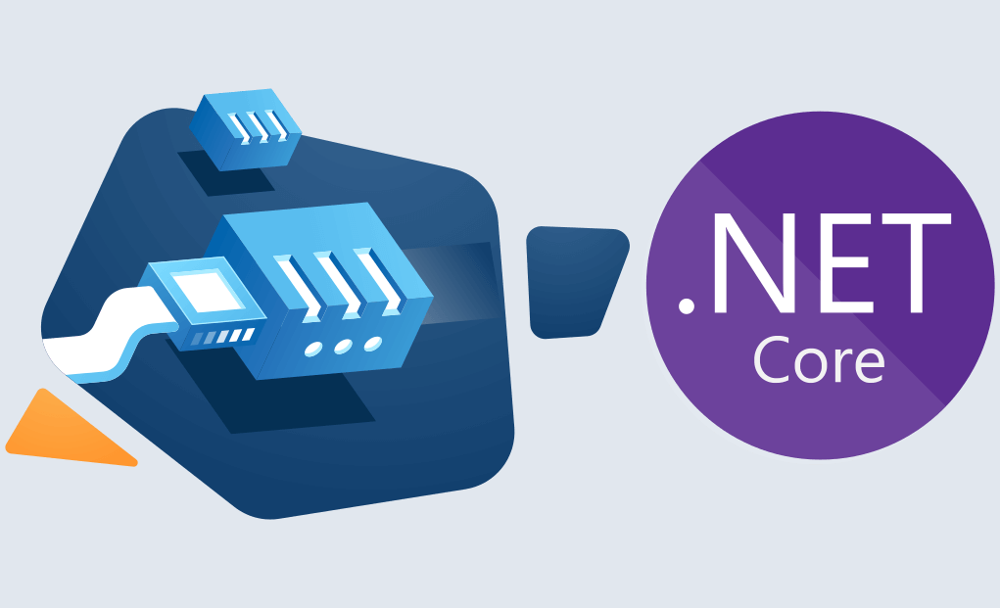

- [WebSocket](#websocket)
  - [Instalando y Configurando WebSockets](#instalando-y-configurando-websockets)
  - [Implementando envío de notificaciones a clientes](#implementando-envío-de-notificaciones-a-clientes)
- [Práctica de clase, Notificaciones con Websockets](#práctica-de-clase-notificaciones-con-websockets)


# WebSocket
Un WebSocket es un protocolo de comunicación bidireccional en tiempo real que se establece entre un cliente y un servidor a través de una conexión TCP (Transmission Control Protocol). A diferencia del protocolo HTTP (Hypertext Transfer Protocol), que sigue un modelo de solicitud-respuesta, los WebSockets permiten una comunicación continua y bidireccional entre el cliente y el servidor.

Los WebSockets se utilizan en servicios web para habilitar la comunicación en tiempo real entre el cliente y el servidor. Anteriormente, para lograr una comunicación en tiempo real, se utilizaban técnicas como la "polling" o "long polling", donde el cliente enviaba repetidamente solicitudes al servidor para verificar si había alguna actualización disponible. Esto generaba una carga adicional tanto en el cliente como en el servidor.

Con los WebSockets, se establece una conexión persistente entre el cliente y el servidor, lo que permite que los dos extremos se comuniquen de manera eficiente y en tiempo real. Una vez que se establece la conexión WebSocket, tanto el cliente como el servidor pueden enviar mensajes en cualquier momento sin necesidad de esperar una solicitud explícita.

Los WebSockets son ampliamente utilizados en aplicaciones web que requieren actualizaciones en tiempo real, como notificaciones, chats en línea, juegos multijugador, aplicaciones de colaboración en tiempo real y paneles de control en tiempo real. Proporcionan una forma eficiente y escalable de mantener una comunicación bidireccional entre el cliente y el servidor, lo que mejora la experiencia del usuario y permite la implementación de aplicaciones web más interactivas y dinámicas.


## Instalando y Configurando WebSockets
Para configurar WebSockets en ASP.NET Core, necesitamos definir un middleware que maneje las conexiones WebSocket. Aquí te muestro cómo configurarlo:

```csharp
// Startup.cs o Program.cs dependiendo de la versión de ASP.NET Core

public class Startup
{
    public void ConfigureServices(IServiceCollection services)
    {
        // Configuración de servicios, si es necesario
    }

    public void Configure(IApplicationBuilder app, IWebHostEnvironment env)
    {
        if (env.IsDevelopment())
        {
            app.UseDeveloperExceptionPage();
        }

        // Habilitar WebSockets
        var webSocketOptions = new WebSocketOptions
        {
            KeepAliveInterval = TimeSpan.FromSeconds(120),
            ReceiveBufferSize = 4 * 1024
        };

        app.UseWebSockets(webSocketOptions);

        app.UseRouting();

        app.UseEndpoints(endpoints =>
        {
            endpoints.Map("/ws/{version}/productos", async context =>
            {
                if (context.WebSockets.IsWebSocketRequest)
                {
                    var webSocket = await context.WebSockets.AcceptWebSocketAsync();
                    var handler = new WebSocketHandler(webSocket);
                    await handler.Handle();
                }
                else
                {
                    context.Response.StatusCode = 400;
                }
            });
        });
    }
}
```

En este ejemplo, hemos configurado un endpoint para WebSockets en `/ws/{version}/productos`. Ahora definimos un manejador para gestionar la conexión y los mensajes.

```csharp
public class WebSocketHandler
{
    private readonly WebSocket _webSocket;
    private static readonly ConcurrentDictionary<WebSocket, bool> _sockets = new();

    public WebSocketHandler(WebSocket webSocket)
    {
        _webSocket = webSocket;
        _sockets.TryAdd(_webSocket, true);
    }

    public async Task Handle()
    {
        var buffer = new byte[1024 * 4];
        WebSocketReceiveResult result = await _webSocket.ReceiveAsync(new ArraySegment<byte>(buffer), CancellationToken.None);

        while (!result.CloseStatus.HasValue)
        {
            var serverMessage = Encoding.UTF8.GetBytes($"Server: Received at {DateTime.Now}");
            await _webSocket.SendAsync(new ArraySegment<byte>(serverMessage, 0, serverMessage.Length), result.MessageType, result.EndOfMessage, CancellationToken.None);

            result = await _webSocket.ReceiveAsync(new ArraySegment<byte>(buffer), CancellationToken.None);
        }

        _sockets.TryRemove(_webSocket, out _);
        await _webSocket.CloseAsync(result.CloseStatus.Value, result.CloseStatusDescription, CancellationToken.None);
    }

    public static async Task BroadcastMessage(string message)
    {
        var messageBuffer = Encoding.UTF8.GetBytes(message);

        foreach (var socket in _sockets.Keys)
        {
            if (socket.State == WebSocketState.Open)
            {
                await socket.SendAsync(new ArraySegment<byte>(messageBuffer, 0, messageBuffer.Length), WebSocketMessageType.Text, true, CancellationToken.None);
            }
        }
    }
}
```

## Implementando envío de notificaciones a clientes
Para enviar notificaciones desde un servicio en ASP.NET Core, podemos usar el método `BroadcastMessage` del `WebSocketHandler` que hemos definido.

```csharp
public class ProductoService
{
    // Método para guardar un producto y notificar a los clientes
    public async Task<Producto> SaveAsync(ProductoCreateDto productoCreateDto)
    {
        // Lógica para guardar el producto
        // ...

        // Enviar notificación a los clientes conectados
        await WebSocketHandler.BroadcastMessage("Producto guardado: " + productoCreateDto.Nombre);
        
        return producto; // Retornar el producto guardado
    }
}
```

En este ejemplo, cuando se guarda un producto, se envía una notificación a todos los clientes conectados a través de WebSockets. Esto se hace utilizando el método `BroadcastMessage` de la clase `WebSocketHandler`.

# Práctica de clase, Notificaciones con Websockets

1. Crea un sistema de notificaciones para recibir los cambios sobre Funkos, especialmente cuando se crea un funko nuevo, o se modifica o borra uno existente.
2. Testea los repositorios, servicios y controladores con la nueva funcionalidad.