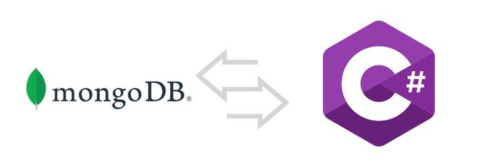

- [NoSQL](#nosql)
  - [MongoDB](#mongodb)
    - [Diseñado en MongoDB](#diseñado-en-mongodb)
    - [Consultando en MongoDB](#consultando-en-mongodb)
    - [Comparativa SQL vs NoSQL con MongoDB](#comparativa-sql-vs-nosql-con-mongodb)
    - [Funciones de Búsqueda en MongoDB](#funciones-de-búsqueda-en-mongodb)
    - [Funciones de Creación en MongoDB](#funciones-de-creación-en-mongodb)
    - [Funciones de Actualización en MongoDB](#funciones-de-actualización-en-mongodb)
    - [Funciones de Eliminación en MongoDB](#funciones-de-eliminación-en-mongodb)
  - [Spring Data MongoDB en ASP.NET Core](#spring-data-mongodb-en-aspnet-core)
    - [Configuración](#configuración)
    - [Definiendo los modelos y colecciones](#definiendo-los-modelos-y-colecciones)
    - [Trabajando con referencias](#trabajando-con-referencias)
      - [DBRef](#dbref)
      - [DocumentReference](#documentreference)
    - [Definiendo el repositorio](#definiendo-el-repositorio)
    - [Desarrollando nuestro Servicio](#desarrollando-nuestro-servicio)
    - [Testeando nuestro código](#testeando-nuestro-código)
      - [Testeado repositorios de MongoDB](#testeado-repositorios-de-mongodb)
      - [Testeado servicios](#testeado-servicios)
      - [Testear los controladores](#testear-los-controladores)
- [Práctica de clase: MongoDB](#práctica-de-clase-mongodb)
  - [Testear los controladores](#testear-los-controladores-1)


# NoSQL
**NoSQL** es un término que se utiliza para describir una nueva generación de sistemas de gestión de bases de datos que no están basados en el modelo relacional tradicional, que es el que utiliza SQL. NoSQL significa "no solo SQL", lo que indica que estos sistemas pueden soportar SQL pero también tienen otros métodos de interactuar con los datos.

**Ventajas de NoSQL sobre SQL:**

1. **Escalabilidad:** Las bases de datos NoSQL están diseñadas para expandirse fácilmente y manejar más datos simplemente añadiendo más servidores a la red. Esto se conoce como escalabilidad horizontal. En contraste, las bases de datos SQL a menudo requieren servidores más potentes (escalabilidad vertical) a medida que crecen.

2. **Flexibilidad de los esquemas:** Las bases de datos NoSQL a menudo no requieren un esquema fijo, lo que significa que puedes añadir o cambiar campos en los datos sin tener que modificar toda la base de datos.

3. **Alto rendimiento:** Las bases de datos NoSQL a menudo pueden manejar transacciones de lectura y escritura a alta velocidad, lo que las hace adecuadas para aplicaciones en tiempo real y de big data.

**Desventajas de NoSQL sobre SQL:**

1. **Consistencia:** Aunque las bases de datos NoSQL pueden manejar grandes volúmenes de datos a alta velocidad, a veces lo hacen a expensas de la consistencia, lo que significa que puede haber un retraso antes de que todos los servidores en la red reflejen una actualización de datos.

2. **Madurez:** Las tecnologías NoSQL son relativamente nuevas en comparación con las bases de datos SQL, lo que significa que pueden no tener todas las características de las bases de datos SQL, y puede haber menos expertos disponibles para ayudar en su implementación y mantenimiento.

3. **Interoperabilidad:** Las bases de datos SQL tienen un estándar de lenguaje (SQL) que es coherente entre diferentes sistemas. Las bases de datos NoSQL, por otro lado, pueden tener interfaces de consulta muy diferentes.

## MongoDB

**MongoDB** es un sistema de base de datos NoSQL basado en documentos. En lugar de almacenar los datos en tablas como se hace en un sistema relacional, MongoDB almacena los datos en documentos BSON, que es una representación binaria de JSON.

**Características principales de MongoDB:**

1. **Modelo de datos flexible:** MongoDB no requiere un esquema de datos fijo, lo que significa que los documentos en una colección no necesitan tener la misma estructura.

2. **Escalabilidad horizontal:** MongoDB puede manejar grandes cantidades de datos distribuyendo los datos en muchos servidores.

3. **Alta disponibilidad:** MongoDB tiene soporte para replicación, lo que proporciona redundancia de datos y alta disponibilidad.

4. **Soporte para consultas complejas:** MongoDB admite una rica sintaxis de consulta que puede incluir operaciones de búsqueda, actualización, eliminación, etc.

**¿Qué aporta MongoDB?**

MongoDB es particularmente útil para aplicaciones que necesitan manejar grandes cantidades de datos con estructuras variadas. Es ideal para proyectos que requieren flexibilidad, escalabilidad y rendimiento. También es una buena opción cuando se necesita un modelo de datos más intuitivo y natural que el modelo relacional. Sin embargo, como cualquier tecnología, es importante entender sus limitaciones y asegurarse de que es la elección correcta para las necesidades específicas de tu proyecto.

### Diseñado en MongoDB
Las bases de datos NoSQL como MongoDB ofrecen varias ventajas en términos de diseño de datos, especialmente cuando se trata de manejar relaciones uno a uno y uno a muchos.

1. **Flexibilidad del esquema**: A diferencia de las bases de datos SQL, las bases de datos NoSQL no requieren un esquema fijo. Esto significa que puedes almacenar documentos con diferentes estructuras en la misma colección. Esta flexibilidad puede ser muy útil cuando los datos tienen una estructura naturalmente irregular o cuando los requisitos de los datos cambian con el tiempo.

2. **Documentos embebidos**: MongoDB permite almacenar documentos embebidos, lo que significa que puedes almacenar datos relacionados directamente dentro de un único documento en lugar de dividirlos en varias tablas como en SQL. Esto puede mejorar el rendimiento al reducir la necesidad de realizar costosas operaciones de unión.

3. **Referencias entre documentos**: Aunque MongoDB es una base de datos no relacional, todavía puedes representar relaciones entre datos utilizando referencias entre documentos. Esto es similar al concepto de claves foráneas en SQL. Sin embargo, a diferencia de SQL, MongoDB no impone la integridad referencial, por lo que tienes más flexibilidad y control.

En términos de diseño de datos, la elección entre utilizar documentos embebidos o referencias entre documentos depende en gran medida de tus necesidades específicas. Los documentos embebidos pueden ser una buena opción si los datos relacionados suelen ser consultados juntos y si no hay demasiados datos para embeber en un único documento. Las referencias entre documentos pueden ser una mejor opción si los datos relacionados son grandes o si necesitas más flexibilidad para consultar los datos de diferentes maneras.

### Consultando en MongoDB
El lenguaje de consulta de MongoDB es una interfaz de estilo JSON (JavaScript Object Notation) para interactuar con la base de datos. Aunque no es SQL, es bastante expresivo y permite realizar una variedad de operaciones en los datos.

Aquí hay algunos ejemplos de cómo se ve el lenguaje de consulta de MongoDB para un [CRUD](https://www.mongodb.com/docs/manual/crud/):

1. **Consulta básica:** Para encontrar todos los documentos en una colección que cumplan con ciertos criterios, puedes usar el método `find()`. Por ejemplo, para encontrar todos los documentos en la colección "usuarios" donde el campo "nombre" es "Juan", podrías usar:

    ```javascript
    db.usuarios.find({ nombre: "Juan" })
    ```

2. **Inserción de documentos:** Para insertar un nuevo documento en una colección, puedes usar el método `insert()`. Por ejemplo, para insertar un nuevo usuario en la colección "usuarios", podrías usar:

    ```javascript
    db.usuarios.insert({ nombre: "Juan", edad: 30, ciudad: "Madrid" })
    ```

### Comparativa SQL vs NoSQL con MongoDB
MongoDB, como base de datos NoSQL, se diferencia significativamente de las bases de datos SQL tradicionales en varios aspectos:

- **Modelo de Datos:** SQL utiliza un modelo de datos tabular con filas y columnas, mientras que MongoDB utiliza un modelo de documentos flexible que permite estructuras de datos anidadas.

- **Consultas:** SQL utiliza el lenguaje SQL estándar para realizar consultas, mientras que MongoDB utiliza un lenguaje de consulta basado en JSON que es más flexible para estructuras de datos complejas.

- **Escalabilidad:** Las bases de datos SQL generalmente escalan verticalmente (mejorando el hardware de un solo servidor), mientras que MongoDB está diseñado para escalar horizontalmente (aumentando el número de servidores).

### Funciones de Búsqueda en MongoDB
En MongoDB, las búsquedas se realizan utilizando el método `find()`, que permite especificar criterios de búsqueda en forma de documentos JSON. Por ejemplo:

```javascript
db.usuarios.find({ edad: { $gt: 25 } })
```

Este ejemplo busca todos los documentos en la colección "usuarios" donde la edad es mayor que 25.

### Funciones de Creación en MongoDB
Para crear o insertar documentos en MongoDB, se utiliza el método `insertOne()` o `insertMany()`. Ejemplo:

```javascript
db.usuarios.insertOne({ nombre: "Carlos", edad: 28, ciudad: "Barcelona" })
```

### Funciones de Actualización en MongoDB
Para actualizar documentos en MongoDB, se utiliza el método `updateOne()` o `updateMany()`. Ejemplo:

```javascript
db.usuarios.updateOne({ nombre: "Carlos" }, { $set: { edad: 29 } })
```

### Funciones de Eliminación en MongoDB
Para eliminar documentos en MongoDB, se utiliza el método `deleteOne()` o `deleteMany()`. Ejemplo:

```javascript
db.usuarios.deleteOne({ nombre: "Carlos" })
```

## Spring Data MongoDB en ASP.NET Core

### Configuración
En ASP.NET Core, para trabajar con MongoDB, puedes utilizar la biblioteca `MongoDB.Driver`. Primero, asegúrate de instalar el paquete NuGet:

```bash
dotnet add package MongoDB.Driver
```

Luego, configura la conexión a MongoDB en tu archivo `appsettings.json`:

```json
{
  "MongoDB": {
    "ConnectionString": "mongodb://localhost:27017",
    "Database": "nombreDeTuBaseDeDatos"
  }
}
```

En tu clase `Startup.cs` o en el archivo `Program.cs` (si estás utilizando .NET 6 o superior con una API mínima), configura el servicio de MongoDB:

```csharp
builder.Services.Configure<MongoDBSettings>(
    builder.Configuration.GetSection("MongoDB"));

builder.Services.AddSingleton<IMongoClient, MongoClient>(
    s => new MongoClient(builder.Configuration.GetValue<string>("MongoDB:ConnectionString")));
```

### Definiendo los modelos y colecciones
Define tus modelos como clases de C# con propiedades que representen los campos de tus documentos en MongoDB. Por ejemplo, un modelo de usuario podría verse así:

```csharp
public class Usuario
{
    public ObjectId Id { get; set; }
    public string Nombre { get; set; }
    public int Edad { get; set; }
    public string Ciudad { get; set; }
}
```

### Trabajando con referencias

#### DBRef
En MongoDB, puedes utilizar referencias manuales para establecer relaciones entre documentos. En C#, esto se representa típicamente como una propiedad que almacena el `ObjectId` de otro documento.

#### DocumentReference
Para manejar referencias entre documentos de manera más explícita, puedes crear una clase que encapsule la lógica de carga de documentos referenciados.

### Definiendo el repositorio
Crea un repositorio para encapsular el acceso a la base de datos. Por ejemplo:

```csharp
public class UsuarioRepository
{
    private readonly IMongoCollection<Usuario> _usuarios;

    public UsuarioRepository(IMongoClient client, string databaseName)
    {
        var database = client.GetDatabase(databaseName);
        _usuarios = database.GetCollection<Usuario>("usuarios");
    }

    public async Task<List<Usuario>> GetUsuariosAsync() =>
        await _usuarios.Find(usuario => true).ToListAsync();

    public async Task<Usuario> GetUsuarioAsync(ObjectId id) =>
        await _usuarios.Find<Usuario>(usuario => usuario.Id == id).FirstOrDefaultAsync();

    public async Task CreateUsuarioAsync(Usuario usuario) =>
        await _usuarios.InsertOneAsync(usuario);

    public async Task UpdateUsuarioAsync(ObjectId id, Usuario usuarioIn) =>
        await _usuarios.ReplaceOneAsync(usuario => usuario.Id == id, usuarioIn);

    public async Task RemoveUsuarioAsync(ObjectId id) =>
        await _usuarios.DeleteOneAsync(usuario => usuario.Id == id);
}
```

### Desarrollando nuestro Servicio
Implementa un servicio que utilice el repositorio para manejar la lógica de negocio. Esto puede incluir validaciones, transformaciones de datos, etc.

### Testeando nuestro código

#### Testeado repositorios de MongoDB
Para probar los repositorios, puedes utilizar una base de datos de prueba o un mock de MongoDB. Utiliza frameworks de pruebas como xUnit o NUnit junto con bibliotecas de mocking como Moq.

#### Testeado servicios
De manera similar, prueba los servicios usando mocks para simular el comportamiento del repositorio y verificar que la lógica de negocio se ejecute correctamente.

#### Testear los controladores
Utiliza pruebas de integración para asegurarte de que los controladores respondan correctamente a las solicitudes HTTP. Esto puede incluir la configuración de un servidor de prueba utilizando `TestServer` en ASP.NET Core.

# Práctica de clase: MongoDB
1. Crea un Pedido que estará compuesto de un Cliente con su dirección y de distintas Líneas de Pedido. El pedido debe calcular el total de items y el precio total. Se debe almacenar en MongoDB.
2. Crea un repositorios y servicio que permita crear, leer, actualizar y eliminar pedidos.
Se debe tener en cuenta que no se puede añadir un Funko si no hay stock suficiente y que al devolverlo, se debe ajustar el stock.
3. Recuerda añadir consultas con paginación y búsqueda personalizadas.
4. Crea los test necesarios de repositorio (si los hay), servicio y controlador.


## Testear los controladores
En este caso todo sigue siendo igual tal y como hemos visto en anteriores ocasiones. Se recomienda mockear el servicio.

