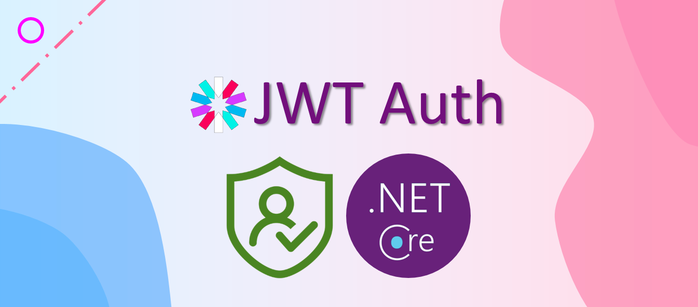

- [Librerías Necesarias](#librerías-necesarias)
- [Configuración de Autenticación y Autorización](#configuración-de-autenticación-y-autorización)
  - [Configuración de JWT](#configuración-de-jwt)
    - [Implementación](#implementación)
      - [Entidad de Usuario](#entidad-de-usuario)
      - [Repositorio de Usuario](#repositorio-de-usuario)
      - [Servicio de Usuario](#servicio-de-usuario)
    - [Servicio de Usuario con BCrypt](#servicio-de-usuario-con-bcrypt)
      - [Hashear una Contraseña](#hashear-una-contraseña)
      - [Verificar una Contraseña](#verificar-una-contraseña)
    - [Consideraciones de Seguridad](#consideraciones-de-seguridad)
      - [Servicio para JWT](#servicio-para-jwt)
      - [Controladores](#controladores)
    - [Anotaciones y Protección de Rutas](#anotaciones-y-protección-de-rutas)
    - [Test de Autenticación y Autorización](#test-de-autenticación-y-autorización)
  - [SSL y TLS](#ssl-y-tls)
    - [Librerías Necesarias](#librerías-necesarias-1)
    - [Generación de Certificados](#generación-de-certificados)
    - [Configuración en ASP.NET Core](#configuración-en-aspnet-core)
      - [appsettings.json](#appsettingsjson)
      - [Configuración de Kestrel en `Program.cs`](#configuración-de-kestrel-en-programcs)
    - [Notas Adicionales](#notas-adicionales)
- [Práctica de clase: Seguridad](#práctica-de-clase-seguridad)


# Librerías Necesarias

1. **ASP.NET Core**: Para construir aplicaciones web robustas.
2. **Entity Framework Core**: Para el acceso a datos y mapeo objeto-relacional.
3. **Microsoft.AspNetCore.Authentication.JwtBearer**: Para la basada en JWT.
4. **AutoMapper**: Para mapear objetos de datos a objetos de dominio y viceversa.
5. **FluentValidation**: Para la validación de modelos de entrada.

# Configuración de Autenticación y Autorización

## Configuración de JWT

En ASP.NET Core, configuramos JWT en `Program.cs` o `Startup.cs`:

```csharp
var builder = WebApplication.CreateBuilder(args);

// Configuración de JWT
builder.Services.AddAuthentication(options =>
{
    options.DefaultAuthenticateScheme = JwtBearerDefaults.AuthenticationScheme;
    options.DefaultChallengeScheme = JwtBearerDefaults.AuthenticationScheme;
}).AddJwtBearer(options =>
{
    options.TokenValidationParameters = new TokenValidationParameters
    {
        ValidateIssuer = true,
        ValidateAudience = true,
        ValidateLifetime = true,
        ValidateIssuerSigningKey = true,
        ValidIssuer = builder.Configuration["Jwt:Issuer"],
        ValidAudience = builder.Configuration["Jwt:Audience"],
        IssuerSigningKey = new SymmetricSecurityKey(Encoding.UTF8.GetBytes(builder.Configuration["Jwt:Key"]))
    };
});

// Importante aquí definimos los roles de los usuarios permitidos
builder.Services.AddAuthorization(options =>
{
    options.AddPolicy("AdminPolicy", policy => policy.RequireRole("Admin"));
});

var app = builder.Build();

app.UseAuthentication();
app.UseAuthorization();
```

### Implementación

#### Entidad de Usuario

Define la entidad `User`:

```csharp
public class User
{
    public int Id { get; set; }
    public string Username { get; set; }
    public string PasswordHash { get; set; }
    public string Role { get; set; }
}
```

#### Repositorio de Usuario

Interfaz y clase de implementación para el repositorio de usuarios:

```csharp
public interface IUserRepository
{
    User GetUserByUsername(string username);
    void AddUser(User user);
}

public class UserRepository : IUserRepository
{
    private readonly ApplicationDbContext _context;

    public UserRepository(ApplicationDbContext context)
    {
        _context = context;
    }

    public User GetUserByUsername(string username) =>
        _context.Users.SingleOrDefault(u => u.Username == username);

    public void AddUser(User user)
    {
        _context.Users.Add(user);
        _context.SaveChanges();
    }
}
```

#### Servicio de Usuario

Servicio para gestionar la lógica de negocio relacionada con usuarios. 

Para integrar BCrypt en el servicio de usuario de tu aplicación ASP.NET Core, puedes modificar el código para utilizar la biblioteca `BCrypt.Net-Next` en lugar del servicio `IPasswordHasher<User>`. Esto te permitirá manejar de manera segura el hashing y la verificación de contraseñas. Aquí te muestro cómo hacerlo, junto con la explicación sobre el uso de BCrypt.

### Servicio de Usuario con BCrypt

A continuación, se presenta el código actualizado para el servicio, utilizando BCrypt para el manejo de contraseñas:

```csharp
using BCrypt.Net;

public interface IUserService
{
    void RegisterUser(UserDto userDto);
    string Authenticate(string username, string password);
}

public class UserService : IUserService
{
    private readonly IUserRepository _userRepository;
    private readonly IJwtService _jwtService;

    public UserService(IUserRepository userRepository, IJwtService jwtService)
    {
        _userRepository = userRepository;
        _jwtService = jwtService;
    }

    public void RegisterUser(UserDto userDto)
    {
        // Hashear la contraseña usando BCrypt
        string hashedPassword = BCrypt.Net.BCrypt.HashPassword(userDto.Password);

        var user = new User
        {
            Username = userDto.Username,
            PasswordHash = hashedPassword,
            Role = userDto.Role
        };

        _userRepository.AddUser(user);
    }

    public string Authenticate(string username, string password)
    {
        var user = _userRepository.GetUserByUsername(username);
        if (user == null || !BCrypt.Net.BCrypt.Verify(password, user.PasswordHash))
        {
            throw new UnauthorizedAccessException("Credenciales inválidas");
        }

        return _jwtService.GenerateToken(user);
    }
}
```

#### Hashear una Contraseña

Cuando un usuario se registra o actualiza su contraseña, se debe almacenar de forma segura en la base de datos utilizando un hash. Con BCrypt, esto se hace fácilmente:

- **Salting Automático**: BCrypt genera automáticamente un "salt" único para cada contraseña, lo cual es crucial para la seguridad, ya que previene ataques de rainbow tables.
- **Cost Factor**: Puedes ajustar el "cost factor" (también conocido como "work factor") para aumentar la dificultad de calcular el hash. Esto se hace aumentando el número de rondas de hashing, lo que incrementa el tiempo necesario para calcular el hash. El valor por defecto suele ser suficiente para la mayoría de las aplicaciones.

```csharp
string hashedPassword = BCrypt.Net.BCrypt.HashPassword(userDto.Password);
```

#### Verificar una Contraseña

Durante la autenticación, se verifica la contraseña proporcionada por el usuario comparándola con el hash almacenado:

- **Verificación Segura**: BCrypt proporciona un método seguro para verificar si una contraseña proporcionada coincide con el hash almacenado.

```csharp
if (!BCrypt.Net.BCrypt.Verify(password, user.PasswordHash))
{
    throw new UnauthorizedAccessException("Credenciales inválidas");
}
```

### Consideraciones de Seguridad

- **Almacenamiento Seguro**: Asegúrate de proteger tu base de datos contra accesos no autorizados, ya que contiene los hashes de las contraseñas.
- **Actualización de Cost Factor**: Considera revisar periódicamente el "cost factor" para asegurar que sigue siendo adecuado a medida que el hardware mejora.

Al integrar BCrypt de esta manera, tu aplicación manejará las contraseñas de manera segura, protegiendo a los usuarios contra ataques comunes relacionados con la autenticación.


#### Servicio para JWT

Servicio para generar y validar tokens JWT:

```csharp
public interface IJwtService
{
    string GenerateToken(User user);
}

public class JwtService : IJwtService
{
    private readonly IConfiguration _configuration;

    public JwtService(IConfiguration configuration)
    {
        _configuration = configuration;
    }

    public string GenerateToken(User user)
    {
        var claims = new[]
        {
            new Claim(JwtRegisteredClaimNames.Sub, user.Username),
            new Claim(ClaimTypes.Role, user.Role),
            new Claim(JwtRegisteredClaimNames.Jti, Guid.NewGuid().ToString())
        };

        var key = new SymmetricSecurityKey(Encoding.UTF8.GetBytes(_configuration["Jwt:Key"]));
        var creds = new SigningCredentials(key, SecurityAlgorithms.HmacSha256);

        var token = new JwtSecurityToken(
            issuer: _configuration["Jwt:Issuer"],
            audience: _configuration["Jwt:Audience"],
            claims: claims,
            expires: DateTime.Now.AddMinutes(30),
            signingCredentials: creds);

        return new JwtSecurityTokenHandler().WriteToken(token);
    }
}
```

#### Controladores

Ejemplo de controlador para autenticación y gestión de usuarios:

```csharp
[ApiController]
[Route("api/[controller]")]
public class AuthController : ControllerBase
{
    private readonly IUserService _userService;

    public AuthController(IUserService userService)
    {
        _userService = userService;
    }

    [HttpPost("register")]
    public IActionResult Register([FromBody] UserDto userDto)
    {
        _userService.RegisterUser(userDto);
        return Ok();
    }

    [HttpPost("login")]
    public IActionResult Login([FromBody] LoginDto loginDto)
    {
        var token = _userService.Authenticate(loginDto.Username, loginDto.Password);
        return Ok(new { Token = token });
    }
}
```

### Anotaciones y Protección de Rutas

En ASP.NET Core, las políticas de autorización se aplican usando atributos:

```csharp
[Authorize(Roles = "Admin")]
[HttpGet("admin-resource")]
public IActionResult GetAdminResource()
{
    return Ok("This is a protected admin resource.");
}
```

### Test de Autenticación y Autorización

Para probar la autenticación y autorización, puedes utilizar `xUnit` junto con `Microsoft.AspNetCore.Mvc.Testing` para crear pruebas de integración:

```csharp
public class AuthTests : IClassFixture<WebApplicationFactory<Startup>>
{
    private readonly HttpClient _client;

    public AuthTests(WebApplicationFactory<Startup> factory)
    {
        _client = factory.CreateClient();
    }

    [Fact]
    public async Task Register_ShouldReturnOk()
    {
        var response = await _client.PostAsJsonAsync("/api/auth/register", new { Username = "test", Password = "password", Role = "User" });
        response.EnsureSuccessStatusCode();
    }

    [Fact]
    public async Task Login_ShouldReturnToken()
    {
        var response = await _client.PostAsJsonAsync("/api/auth/login", new { Username = "test", Password = "password" });
        response.EnsureSuccessStatusCode();

        var content = await response.Content.ReadAsAsync<dynamic>();
        Assert.NotNull(content.Token);
    }
}
```

## SSL y TLS

### Librerías Necesarias

En ASP.NET Core, no necesitas agregar librerías adicionales para manejar SSL/TLS, ya que el framework ya incluye soporte nativo para estas características. Solo necesitas asegurarte de que tu entorno de desarrollo y despliegue tenga acceso a OpenSSL o herramientas equivalentes para gestionar certificados.

### Generación de Certificados

Puedes usar `openssl` para generar un certificado y una clave privada en formato PEM, que es comúnmente utilizado en entornos .NET.

```bash
# Generar una clave privada
openssl genpkey -algorithm RSA -out server.key -pkeyopt rsa_keygen_bits:4096

# Generar un certificado autofirmado
openssl req -new -x509 -key server.key -out server.crt -days 365
```

### Configuración en ASP.NET Core

Para configurar tu aplicación ASP.NET Core para usar SSL/TLS, necesitas modificar el archivo `appsettings.json` y el código de inicio de tu aplicación.

#### appsettings.json

Agrega la configuración para los puertos HTTP y HTTPS:

```json
{
  "Kestrel": {
    "Endpoints": {
      "Http": {
        "Url": "http://localhost:3080"
      },
      "Https": {
        "Url": "https://localhost:5001",
        "Certificate": {
          "Path": "cert/server.pfx",
          "Password": "1234567"
        }
      }
    }
  }
}
```

#### Configuración de Kestrel en `Program.cs`

En ASP.NET Core minimal, la configuración de Kestrel se realiza en el archivo `Program.cs`. Aquí es donde configuramos los puertos y los certificados.

```csharp
using Microsoft.AspNetCore.Builder;
using Microsoft.AspNetCore.Hosting;
using Microsoft.Extensions.Hosting;

var builder = WebApplication.CreateBuilder(args);

// Configuración de Kestrel para soportar HTTP y HTTPS
builder.WebHost.ConfigureKestrel(options =>
{
    options.ListenAnyIP(3080); // Puerto HTTP
    options.ListenAnyIP(5001, listenOptions =>
    {
        listenOptions.UseHttps("cert/server.pfx", "1234567"); // Puerto HTTPS
    });
});

var app = builder.Build();

app.MapGet("/", () => "Hello World!");

app.Run();
```

### Notas Adicionales

- **Certificados PFX**: En el ejemplo anterior, se asume que has convertido tu certificado y clave privada a un archivo PFX (PKCS#12) que es comúnmente usado en Windows y soportado por Kestrel. Puedes hacer esta conversión usando OpenSSL:

  ```bash
  openssl pkcs12 -export -out server.pfx -inkey server.key -in server.crt -password pass:1234567
  ```

- **Configuración del Entorno**: Asegúrate de que tu entorno de desarrollo tenga acceso al archivo de certificado y que las rutas en `appsettings.json` sean correctas.

- **Despliegue**: En producción, deberías usar certificados válidos emitidos por una autoridad de certificación (CA) y configurar correctamente el firewall y las políticas de seguridad del servidor.

Este enfoque te permite replicar la funcionalidad de tu aplicación Spring Boot en un entorno ASP.NET Core minimalista, manejando tanto HTTP como HTTPS de manera eficiente.

# Práctica de clase: Seguridad
1. Crea todo el modelo de seguridad para que un usuario pueda registrarse y loguearse en el sistema.
2. Los funkos solo pueden ser creados, modificados y eliminados por un usuario administrador. Pueden verse por todo el mundo.
3. Las categorías solo pueden ser creadas, modificadas y eliminadas por un usuario administrador.
4. Los pedidos solo pueden ser creados, modificados y eliminados por un usuario administrador.
5. Un usuario puede ver y modificar su perfil y sus pedidos.


