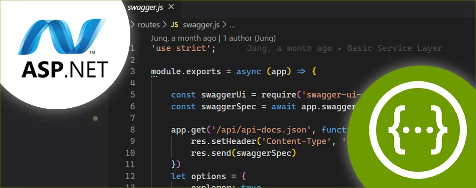

- [CORS](#cors)
    - [Configuración de CORS en ASP.NET Core](#configuración-de-cors-en-aspnet-core)
- [Documentación con Swagger y OpenAPI](#documentación-con-swagger-y-openapi)
    - [Configuración de Swagger en ASP.NET Core](#configuración-de-swagger-en-aspnet-core)
- [Práctica de clase: Swagger y OpenAPI](#práctica-de-clase-swagger-y-openapi)


# CORS

En ASP.NET Core, la configuración de CORS se realiza mediante el uso del middleware correspondiente. Puedes definir las políticas de C el método `ConfigureServices` de la clase `Startup` y aplicarlas en el método `Configure`.

### Configuración de CORS en ASP.NET Core

```csharp
using Microsoft.AspNetCore.Builder;
using Microsoft.Extensions.DependencyInjection;

public class Startup
{
    public void ConfigureServices(IServiceCollection services)
    {
        // Configuración de CORS
        services.AddCors(options =>
        {
            options.AddPolicy("CorsPolicy", builder =>
            {
                builder.WithOrigins("http://localhost:6980") // Permitir solo un dominio
                       .WithMethods("GET", "POST", "PUT", "DELETE") // Métodos permitidos
                       .WithHeaders("Content-Type"); // Encabezados permitidos
            });
        });

        services.AddControllers();
    }

    public void Configure(IApplicationBuilder app)
    {
        // Aplicar la política de CORS
        app.UseCors("CorsPolicy");

        app.UseRouting();
        app.UseEndpoints(endpoints =>
        {
            endpoints.MapControllers();
        });
    }
}
```

En este ejemplo, definimos una política de CORS llamada "CorsPolicy" que permite solicitudes desde `http://localhost:6980` y restringe los métodos HTTP a GET, POST, PUT y DELETE. Esta política se aplica globalmente a todas las rutas de la aplicación.

# Documentación con Swagger y OpenAPI

En ASP.NET Core, puedes utilizar la biblioteca `Swashbuckle.AspNetCore` para integrar Swagger y OpenAPI en tu aplicación. Esto te permite generar documentación interactiva de tus API REST.

### Configuración de Swagger en ASP.NET Core

1. **Agregar la dependencia de Swagger**: Añade el paquete `Swashbuckle.AspNetCore` a tu proyecto. Puedes hacerlo a través de NuGet Package Manager o ejecutando el siguiente comando en la consola del administrador de paquetes:

   ```shell
   dotnet add package Swashbuckle.AspNetCore
   ```

2. **Configurar Swagger en la aplicación**: Modifica la clase `Startup` para configurar Swagger.

```csharp
using Microsoft.AspNetCore.Builder;
using Microsoft.Extensions.DependencyInjection;
using Microsoft.OpenApi.Models;

public class Startup
{
    public void ConfigureServices(IServiceCollection services)
    {
        services.AddControllers();

        // Configuración de Swagger
        services.AddSwaggerGen(c =>
        {
            c.SwaggerDoc("v1", newInfo
            {
                Title = "API REST Tenistas ASP.NET Core 2023",
                Version = "1.0.0",
                Description = "API de ejemplo del curso Desarrollo de un API REST con ASP.NET Core para Profesores/as. 2022/2023",
                TermsOfService = new Uri("https://joseluisgs.dev/docs/license/"),
                Contact = new OpenApiContact
                {
                    Name = "José Luis González Sánchez",
                    Email = "contacto@ejemplo.com"
                },
                License = new OpenApiLicense
                {
                    Name = "CC BY-NC-SA 4.0",
                    Url = new Uri("https://joseluisgs.dev/docs/license/")
                }
            });
        });
    }

    public void Configure(IApplicationBuilder app)
    {
        app.UseRouting();

        // Habilitar Swagger y la interfaz Swagger UI
        app.UseSwagger();
        app.UseSwaggerUI(c =>
        {
            c.SwaggerEndpoint("/swagger/v1/swagger.json", "API REST Tenistas ASP.NET Core 2023");
            c.RoutePrefix = string.Empty; // Para acceder a Swagger UI en la raíz del sitio
        });

        app.UseEndpoints(endpoints =>
        {
            endpoints.MapControllers();
        });
    }
}
```

En este ejemplo, configuramos Swagger para documentar nuestra API. Definimos un documento de Swagger con metadatos como el título, la versión, la descripción, los términos de servicio, el contacto y la licencia.


# Práctica de clase: Swagger y OpenAPI
1. Configura Swagger en tu proyecto
2. Documenta los modelos, DTOs y endpoints de tu API para el endpoint de funkos.

