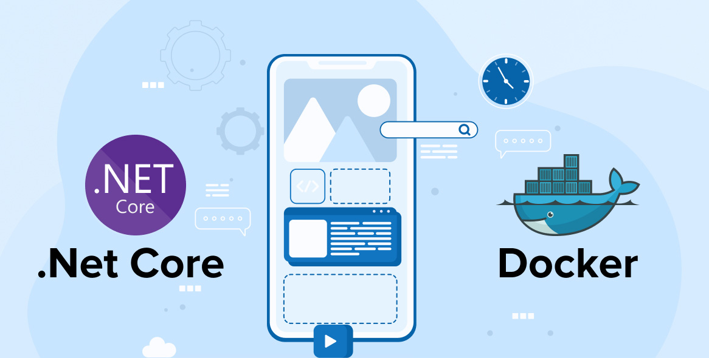

- [Desplegando nuestra aplicación](#desplegando-nuestra-aplicación)
  - [Ajustando perfiles de test](#ajustando-perfiles-de-test)
  - [Creando un archivo ejecutable](#creando-un-archivo-ejecutable)
  - [Despliegue de aplicación .NET en Docker](#despliegue-de-aplicación-net-en-docker)
  - [Usando Docker Compose](#usando-docker-compose)
- [Práctica de clase: Despliegue](#práctica-de-clase-despliegue)


# Desplegando nuestra aplicación

## Ajustando perfiles de test
En ASP.NET Core, los perfiles de configuración se manejan a través de los archivos `appsettings.json`. Puedes crear un archivo `appsettings.Development.json` para configuraciones específicas del entorno de desarrollo. Para establecer el entorno de ejecución, puedes configurar la variable de entorno `ASPNETCORE_ENVIRONMENT`.

```json
// appsettings.Development.json
{
  "Logging": {
    "LogLevel": {
      "Default": "Debug",
      "Microsoft": "Warning"
    }
  }
}
```

Para ejecutar la aplicación en el entorno `Development`, puedes establecer la variable de entorno antes de ejecutar la aplicación:

```bash
export ASPNETCORE_ENVIRONMENT=Development
dotnet run
```

## Creando un archivo ejecutable
Para crear un archivo ejecutable de tu aplicación, utiliza el comando `dotnet publish`:

```bash
dotnet publish -c Release
```

Esto generará un archivo ejecutable en el directorio `bin/Release/netX.X/publish`.

Para ejecutar el archivo, usa el siguiente comando:

```bash
dotnet bin/Release/netX.X/publish/TuAplicacion.dll
```

## Despliegue de aplicación .NET en Docker
Para desplegar una aplicación ASP.NET Core en un contenedor Docker, necesitarás un Dockerfile. Aquí te muestro un ejemplo básico:

```Dockerfile
# Usa una imagen base de .NET SDK para la compilación
# Etapa de compilación
FROM mcr.microsoft.com/dotnet/sdk:8.0 AS build-env
WORKDIR /app

# Copia csproj y restaura dependencias
COPY *.csproj ./
RUN dotnet restore

# Copia todo lo demás y compila
COPY . ./
RUN dotnet publish -c Release -o out

# Etapa de prueba
FROM build-env AS test-env
WORKDIR /app/tests
COPY ./tests ./
RUN dotnet test --logger:trx

# Etapa de ejecución
FROM mcr.microsoft.com/dotnet/aspnet:8.0
WORKDIR /app
COPY --from=build-env /app/out .
ENTRYPOINT ["dotnet", "your-app-name.dll"]
```

Para construir la imagen de Docker:

```bash
docker build -t tu-aplicacion .
```

Y para ejecutar el contenedor:

```bash
docker run -p 8000:8080 -d myapp
```

## Usando Docker Compose
A continuación, puedes utilizar Docker Compose para gestionar tu aplicación. Aquí tienes un ejemplo básico de un archivo `docker-compose.yml` con una aplicación web y una base de datos MySQL:

```yaml
version: '3.8'
services:
  web:
    build: 
      context: .
      dockerfile: Dockerfile
    ports:
      - "8000:8080"
    depends_on:
      - db
  db:
    image: mysql:5.7
    environment:
      MYSQL_ROOT_PASSWORD: password
      MYSQL_DATABASE: testdb
      MYSQL_USER: user
      MYSQL_PASSWORD: password
    volumes:
      - db_data:/var/lib/mysql
    ports:
      - "3306:3306"

volumes:
  db_data:
```

Para construir y ejecutar tu aplicación con Docker Compose:

```bash
docker-compose up --build
```

Este comando construirá la imagen de tu aplicación y luego ejecutará el contenedor.


# Práctica de clase: Despliegue
1. Despliega completamente tu servicio usando docker, incluyendo las bases de datos necesarias para su funcionamiento. Ten en cuenta los perfiles dev y prod, para que puedas crear la imagen con uno y ejecutarla con otro.

